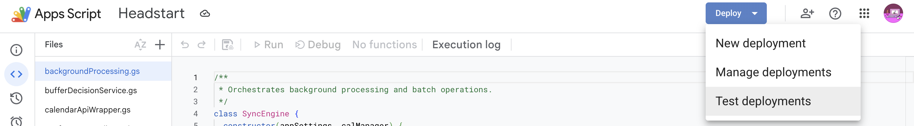

# Headstart

Headstart is a Google Calendar add-on that creates private buffered "shadow" events before the user's real calendar events. It is designed around a copy-and-hide model: the original event stays socially accurate and unchanged, while the user gets a separate actionable event that starts earlier.

## What It Does

- Creates buffered events before source events based on travel or online-meeting rules.
- Supports one-off event buffering from the Calendar event-open surface.
- Supports batch and background sync across selected calendars.
- Preserves shared event integrity by leaving the source event unchanged.
- Carries forward useful context, including notes and conference links when possible.

## Project Structure

The production Apps Script files intentionally live at the repository root rather than inside a `src/` directory. This matches the current `clasp` configuration, where `.clasp.json` uses the repository root as the Apps Script `rootDir`, so `appsscript.json` and the add-on source files can be pushed directly to Google Apps Script. Local-only files such as tests, coverage output, and Node dependencies are excluded through `.claspignore`.

- [controller.js](/Users/folademiladeoyeleke/headstart-local/controller.js): add-on entrypoints and action handlers.
- [userInterface.js](/Users/folademiladeoyeleke/headstart-local/userInterface.js): CardService UI construction.
- [calendarApiWrapper.js](/Users/folademiladeoyeleke/headstart-local/calendarApiWrapper.js): calendar writes, shadow linking, conference sync.
- [conferenceDetailsService.js](/Users/folademiladeoyeleke/headstart-local/conferenceDetailsService.js): advanced Calendar API conference lookup.
- [eventContextFactory.js](/Users/folademiladeoyeleke/headstart-local/eventContextFactory.js): event classification and normalized context extraction.
- [bufferDecisionService.js](/Users/folademiladeoyeleke/headstart-local/bufferDecisionService.js): online vs physical buffer policy.
- [backgroundProcessing.js](/Users/folademiladeoyeleke/headstart-local/backgroundProcessing.js): batch sync and orphan pruning.
- [settingsManager.js](/Users/folademiladeoyeleke/headstart-local/settingsManager.js): user settings and sync state persistence.
- [shadowDescriptionBuilder.js](/Users/folademiladeoyeleke/headstart-local/shadowDescriptionBuilder.js): buffered event description formatting.
- [transitMath.js](/Users/folademiladeoyeleke/headstart-local/transitMath.js): travel estimation helpers.

## Local Workflow

Run tests:
```bash
npm install
```

```bash
npm test -- --runInBand
```

Run coverage:

```bash
npm run test:coverage
```

## Live Testing

Some Headstart behaviour must be checked inside Google Calendar because the local Jest suite can only mock Google Apps Script services. Live testing is especially important for CardService rendering, event-open navigation, Calendar permissions, subscribed calendars, recurring event IDs, conference-data copying, reminders, and Maps-backed travel estimates.

The Apps Script project can be opened here(University of Sheffield Account required):

[Headstart Apps Script project](https://script.google.com/d/1WshgiPtgloGieUV3E6fApsRd7kfBDbButizcOoTZ6_Rz6e6TMUSCkJGj/edit?usp=sharing)

To install the test add-on into Google Calendar:

1. Open the Apps Script project link above.
2. Click `Deploy` in the top-right corner.
3. Choose `Test deployments`.
4. Select the `Google Workspace add-on` test deployment.
5. In the `Deployments` dropdown, choose `Test latest code`.
6. Confirm that the application is `Calendar`.
7. Click `Install`, then `Done`.
8. Open Google Calendar and use the Headstart add-on from the Calendar side panel or event-open surface.

Step 1


Step 2


## Test Suite

The local suite lives in [__tests__](/Users/folademiladeoyeleke/headstart-local/__tests__).

The local tests cover the deterministic business logic and the most important add-on flows through mocked Google Apps Script services. Some parts of Headstart can only be fully tested live inside Google Calendar, especially CardService rendering, event-open navigation, Advanced Calendar API permissions, and behaviour that depends on real Calendar event resources. Those areas are still supported by unit tests around their parameters and fallback decisions, but final confidence comes from live add-on testing.

The `if (typeof module !== 'undefined') { module.exports = ... }` blocks at the bottom of files such as [settingsManager.js](/Users/folademiladeoyeleke/headstart-local/settingsManager.js) are only there for local Jest tests. Google Apps Script does not use CommonJS modules, but Node/Jest needs `module.exports` so individual classes such as `AppSettings` can be imported and tested locally.

- [appSettings.test.js](/Users/folademiladeoyeleke/headstart-local/__tests__/appSettings.test.js): persistence defaults and sync-state formatting.
- [backgroundProcessing.test.js](/Users/folademiladeoyeleke/headstart-local/__tests__/backgroundProcessing.test.js): batch recalculation and skip logic.
- [bufferDecisionService.test.js](/Users/folademiladeoyeleke/headstart-local/__tests__/bufferDecisionService.test.js): online/physical buffer policy branches.
- [calendarApiWrapper.test.js](/Users/folademiladeoyeleke/headstart-local/__tests__/calendarApiWrapper.test.js): shadow linking, exact instance resolution, conference copy.
- [conferenceDetailsService.test.js](/Users/folademiladeoyeleke/headstart-local/__tests__/conferenceDetailsService.test.js): advanced conference lookup and fallback behavior.
- [controller.test.js](/Users/folademiladeoyeleke/headstart-local/__tests__/controller.test.js): event-open routing, per-event actions, manual data entry.
- [eventContextFactory.test.js](/Users/folademiladeoyeleke/headstart-local/__tests__/eventContextFactory.test.js): event-type inference and link/location normalization.
- [shadowDescriptionBuilder.test.js](/Users/folademiladeoyeleke/headstart-local/__tests__/shadowDescriptionBuilder.test.js): buffered-event description formatting.
- [userInterface.test.js](/Users/folademiladeoyeleke/headstart-local/__tests__/userInterface.test.js): CardService action parameter structure.

## Requirements Traceability

The core FR requirements below capture the original functional scope. Several user-facing, phenotypical requirements were later added or tightened after manual alpha testing so the add-on better reflected real Calendar usage, edge cases, and onboarding friction.

| Requirement | Meaning | Main implementation | Main tests |
| --- | --- | --- | --- |
| FR1.1 | Dynamic offset calculation | [bufferDecisionService.js](/Users/folademiladeoyeleke/headstart-local/bufferDecisionService.js), [transitMath.js](/Users/folademiladeoyeleke/headstart-local/transitMath.js) | [bufferDecisionService.test.js](/Users/folademiladeoyeleke/headstart-local/__tests__/bufferDecisionService.test.js) |
| FR1.2 | Buffered event starts earlier than the source | [calendarApiWrapper.js](/Users/folademiladeoyeleke/headstart-local/calendarApiWrapper.js) | [calendarApiWrapper.test.js](/Users/folademiladeoyeleke/headstart-local/__tests__/calendarApiWrapper.test.js) |
| FR1.3 | Original details remain accessible | [shadowDescriptionBuilder.js](/Users/folademiladeoyeleke/headstart-local/shadowDescriptionBuilder.js) | [calendarApiWrapper.test.js](/Users/folademiladeoyeleke/headstart-local/__tests__/calendarApiWrapper.test.js) |
| FR2.1 | Works for invited events | [controller.js](/Users/folademiladeoyeleke/headstart-local/controller.js), [backgroundProcessing.js](/Users/folademiladeoyeleke/headstart-local/backgroundProcessing.js) | [controller.test.js](/Users/folademiladeoyeleke/headstart-local/__tests__/controller.test.js), [backgroundProcessing.test.js](/Users/folademiladeoyeleke/headstart-local/__tests__/backgroundProcessing.test.js) |
| FR2.2 | Supports shared/subscribed calendars | [controller.js](/Users/folademiladeoyeleke/headstart-local/controller.js), [calendarApiWrapper.js](/Users/folademiladeoyeleke/headstart-local/calendarApiWrapper.js) | [controller.test.js](/Users/folademiladeoyeleke/headstart-local/__tests__/controller.test.js), [calendarApiWrapper.test.js](/Users/folademiladeoyeleke/headstart-local/__tests__/calendarApiWrapper.test.js) |
| FR2.3 | Supports self-scheduled events | [controller.js](/Users/folademiladeoyeleke/headstart-local/controller.js) | [controller.test.js](/Users/folademiladeoyeleke/headstart-local/__tests__/controller.test.js) |
| FR2.4 | Excludes online meetings by default | [bufferDecisionService.js](/Users/folademiladeoyeleke/headstart-local/bufferDecisionService.js) | [bufferDecisionService.test.js](/Users/folademiladeoyeleke/headstart-local/__tests__/bufferDecisionService.test.js) |
| FR2.5 | Allows online override | [controller.js](/Users/folademiladeoyeleke/headstart-local/controller.js) | [controller.test.js](/Users/folademiladeoyeleke/headstart-local/__tests__/controller.test.js) |
| FR3.1 | Leaves the source event unchanged | [calendarApiWrapper.js](/Users/folademiladeoyeleke/headstart-local/calendarApiWrapper.js) | [calendarApiWrapper.test.js](/Users/folademiladeoyeleke/headstart-local/__tests__/calendarApiWrapper.test.js) |
| FR4.1 | Supports per-event override | [controller.js](/Users/folademiladeoyeleke/headstart-local/controller.js), [userInterface.js](/Users/folademiladeoyeleke/headstart-local/userInterface.js) | [controller.test.js](/Users/folademiladeoyeleke/headstart-local/__tests__/controller.test.js), [eventContextFactory.test.js](/Users/folademiladeoyeleke/headstart-local/__tests__/eventContextFactory.test.js) |
| FR4.2 | Supports selective tailoring/suppression | Partially addressed through per-event and settings-based control | [controller.test.js](/Users/folademiladeoyeleke/headstart-local/__tests__/controller.test.js), [bufferDecisionService.test.js](/Users/folademiladeoyeleke/headstart-local/__tests__/bufferDecisionService.test.js) |

### Requirements Added After Manual Alpha Testing

| Requirement | User-visible feature | Main implementation | Main tests |
| --- | --- | --- | --- |
| PR1 | Users can create or refresh a buffer from the Calendar event-open surface for a single event | [controller.js](/Users/folademiladeoyeleke/headstart-local/controller.js), [userInterface.js](/Users/folademiladeoyeleke/headstart-local/userInterface.js) | [controller.test.js](/Users/folademiladeoyeleke/headstart-local/__tests__/controller.test.js) |
| PR2 | If an event has no usable location or conferencing, Headstart asks for manual details before buffering | [controller.js](/Users/folademiladeoyeleke/headstart-local/controller.js), [userInterface.js](/Users/folademiladeoyeleke/headstart-local/userInterface.js), [eventContextFactory.js](/Users/folademiladeoyeleke/headstart-local/eventContextFactory.js) | [controller.test.js](/Users/folademiladeoyeleke/headstart-local/__tests__/controller.test.js), [eventContextFactory.test.js](/Users/folademiladeoyeleke/headstart-local/__tests__/eventContextFactory.test.js) |
| PR3 | Hybrid events with both a room and a meeting link prompt the user to choose in-person or online buffering | [controller.js](/Users/folademiladeoyeleke/headstart-local/controller.js), [userInterface.js](/Users/folademiladeoyeleke/headstart-local/userInterface.js) | [controller.test.js](/Users/folademiladeoyeleke/headstart-local/__tests__/controller.test.js) |
| PR4 | Buffered events preserve original notes, start-time context, and conference details in a readable shadow description | [shadowDescriptionBuilder.js](/Users/folademiladeoyeleke/headstart-local/shadowDescriptionBuilder.js), [calendarApiWrapper.js](/Users/folademiladeoyeleke/headstart-local/calendarApiWrapper.js) | [shadowDescriptionBuilder.test.js](/Users/folademiladeoyeleke/headstart-local/__tests__/shadowDescriptionBuilder.test.js), [calendarApiWrapper.test.js](/Users/folademiladeoyeleke/headstart-local/__tests__/calendarApiWrapper.test.js) |
| PR5 | Native conference details are copied onto the buffered event when the source event exposes real `conferenceData`, with fallback link preservation when it does not | [conferenceDetailsService.js](/Users/folademiladeoyeleke/headstart-local/conferenceDetailsService.js), [calendarApiWrapper.js](/Users/folademiladeoyeleke/headstart-local/calendarApiWrapper.js) | [conferenceDetailsService.test.js](/Users/folademiladeoyeleke/headstart-local/__tests__/conferenceDetailsService.test.js), [calendarApiWrapper.test.js](/Users/folademiladeoyeleke/headstart-local/__tests__/calendarApiWrapper.test.js) |
| PR6 | Settings expose walking tolerance, transport preference, online-buffer defaults, and buffered-event reminder timing | [settingsManager.js](/Users/folademiladeoyeleke/headstart-local/settingsManager.js), [userInterface.js](/Users/folademiladeoyeleke/headstart-local/userInterface.js) | [appSettings.test.js](/Users/folademiladeoyeleke/headstart-local/__tests__/appSettings.test.js) |
| PR7 | Headstart prevents users from buffering a shadow event again and de-duplicates repeated shadows for the same source event | [controller.js](/Users/folademiladeoyeleke/headstart-local/controller.js), [calendarApiWrapper.js](/Users/folademiladeoyeleke/headstart-local/calendarApiWrapper.js) | [controller.test.js](/Users/folademiladeoyeleke/headstart-local/__tests__/controller.test.js), [calendarApiWrapper.test.js](/Users/folademiladeoyeleke/headstart-local/__tests__/calendarApiWrapper.test.js) |
| PR8 | Background sync recalculates existing buffers when source timing, title, location, or conference metadata changes | [backgroundProcessing.js](/Users/folademiladeoyeleke/headstart-local/backgroundProcessing.js), [calendarApiWrapper.js](/Users/folademiladeoyeleke/headstart-local/calendarApiWrapper.js) | [backgroundProcessing.test.js](/Users/folademiladeoyeleke/headstart-local/__tests__/backgroundProcessing.test.js), [calendarApiWrapper.test.js](/Users/folademiladeoyeleke/headstart-local/__tests__/calendarApiWrapper.test.js) |

## Current Local Testing limitations

The local test suite covers the major application paths, but it is still a unit-style harness around mocked Apps Script globals. 
